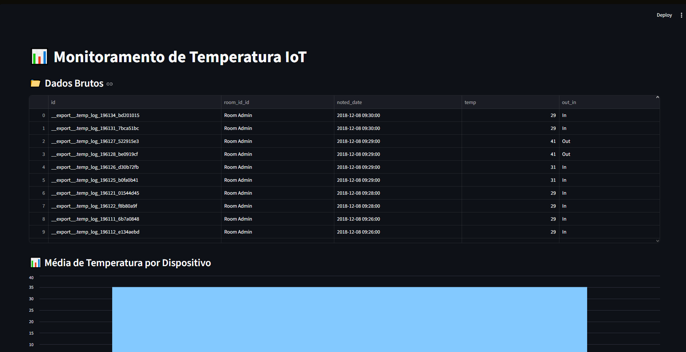
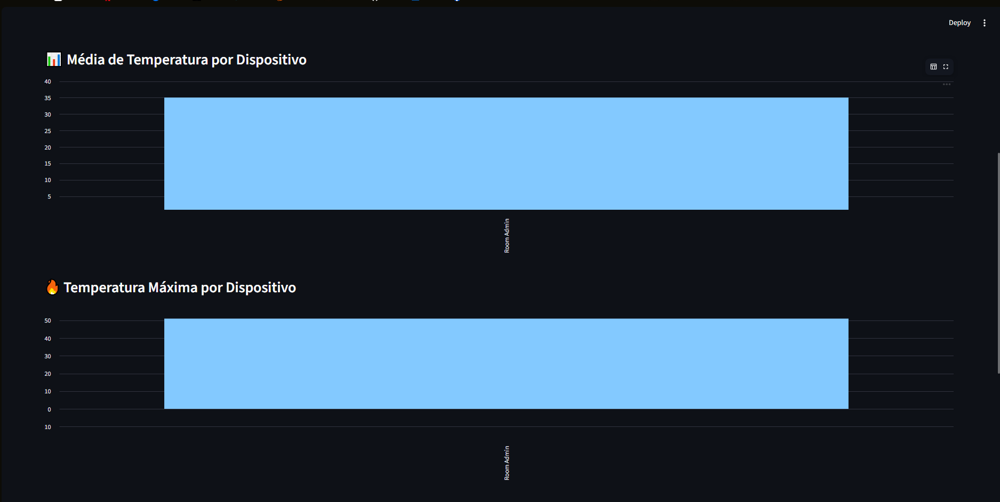
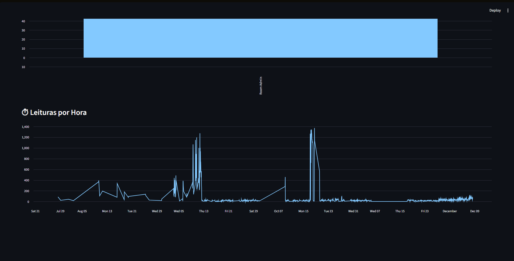

# 📊 IoT Temperature Monitoring Pipeline

Este projeto implementa um pipeline completo de dados IoT, desde a ingestão de um arquivo CSV até a visualização interativa em um dashboard web.

O objetivo é simular um cenário real de monitoramento de temperatura utilizando:

* ETL com Python
* Banco de dados PostgreSQL (via Docker)
* Dashboard com Streamlit

---

## 🔗 Fonte dos Dados

Os dados utilizados neste projeto estão disponíveis publicamente no Kaggle:

👉 https://www.kaggle.com/datasets/atulanandjha/temperature-readings-iot-devices

---

## 🧠 Arquitetura do Projeto

O fluxo de dados segue as etapas abaixo:

CSV → ETL (Python) → PostgreSQL (Docker) → Dashboard (Streamlit)

---

## 📁 Estrutura do Projeto

iot-pipeline/
│
├── etl.py                # Script ETL (carrega CSV para o banco)
├── main.py               # Orquestra o pipeline
├── requirements.txt      # Dependências do projeto
├── docker-compose.yml    # Configuração do PostgreSQL
│
├── data/
│   └── IOT-temp.csv      # Fonte de dados
│
└── app/
    └── app.py            # Dashboard Streamlit

---

## ⚙️ Tecnologias Utilizadas

* Python 3.x
* Pandas
* SQLAlchemy
* PostgreSQL
* Docker
* Streamlit

---

## 🚀 PASSO A PASSO RODAR PROJETO

🔧 1. Clonar ou criar o projeto

Entre na pasta do projeto:

cd D:\Faculdade\iot-pipeline

---

## 🐳 Configuração do Banco de Dados

Execute:

docker-compose up -d

Verifique se está rodando:

docker ps

Você deve ver o container:

postgres-iot

---

## 📦 Instalação das Dependências

Crie e ative um ambiente virtual:

bash
python -m venv venv
venv\Scripts\activate

Instale as dependências:

bash
pip install -r requirements.txt

---

## ⚙️ Executando o ETL

O ETL lê o arquivo CSV e insere os dados no banco:

bash
python etl.py

Ou utilizando o pipeline completo:

bash
python main.py

---

## 🗄️ Verificando os Dados no Banco

Acesse o PostgreSQL via Docker:

bash
docker exec -it postgres-iot psql -U postgres -d iot_db

Execute uma consulta:

sql
SELECT * FROM temperature_readings LIMIT 10;

Sair do SQL

sql
\q

---

## 📊 Executando o Dashboard

bash
streamlit run app/app.py

Acesse no navegador:

http://localhost:8501

---

## 📸 Capturas de Tela do Dashboard

---

## 📈 Funcionalidades do Dashboard

O dashboard apresenta:

### 📁 Dados Brutos

* Visualização completa dos dados carregados

### 📊 Média de Temperatura por Dispositivo

* Gráfico de barras com média por sala/dispositivo

### 🔥 Temperatura Máxima por Dispositivo

* Gráfico de barras com os maiores valores registrados

### ⏱ Leituras por Hora

* Gráfico de linha mostrando volume de leituras ao longo do tempo

---

## 💻 Comandos Git Utilizados

git init
git add .
git commit -m "Projeto IoT pipeline completo"
git branch -M main
git remote add origin https://github.com/seu-usuario/seu-repositorio.git
git push -u origin main

---

## ⚠️ Observações Importantes

* Algumas colunas possuem `/` no nome (ex: `room_id/id`)
* O sistema automaticamente corrige para `_` (ex: `room_id_id`)
* Datas são convertidas para formato datetime para análise temporal

---

## 🚀 Objetivo Acadêmico

Este projeto foi desenvolvido para fins educacionais, demonstrando:

* Integração entre sistemas (ETL + Banco + Dashboard)
* Uso de containers com Docker
* Visualização de dados em tempo real
* Estrutura de pipeline de dados simples

---

## 👨‍💻 Autor

Lucas Ribeiro Soares.

---

## 📌 Melhorias Futuras

* Deploy em nuvem (AWS / Azure / GCP)
* Atualização em tempo real (streaming)
* Filtros interativos no dashboard
* Autenticação de usuários
* Integração com APIs IoT reais

---

## ✅ Status

✔ ETL funcional
✔ Banco integrado
✔ Dashboard completo
✔ Visualizações implementadas

---

## 🎥 Link YouTube

Video Pitch; https://youtu.be/YfKRXoxQOAk
